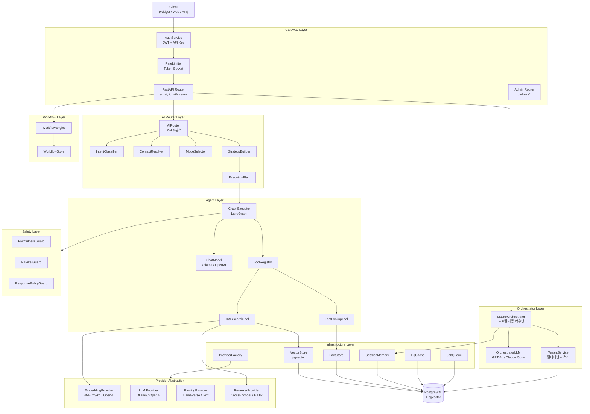
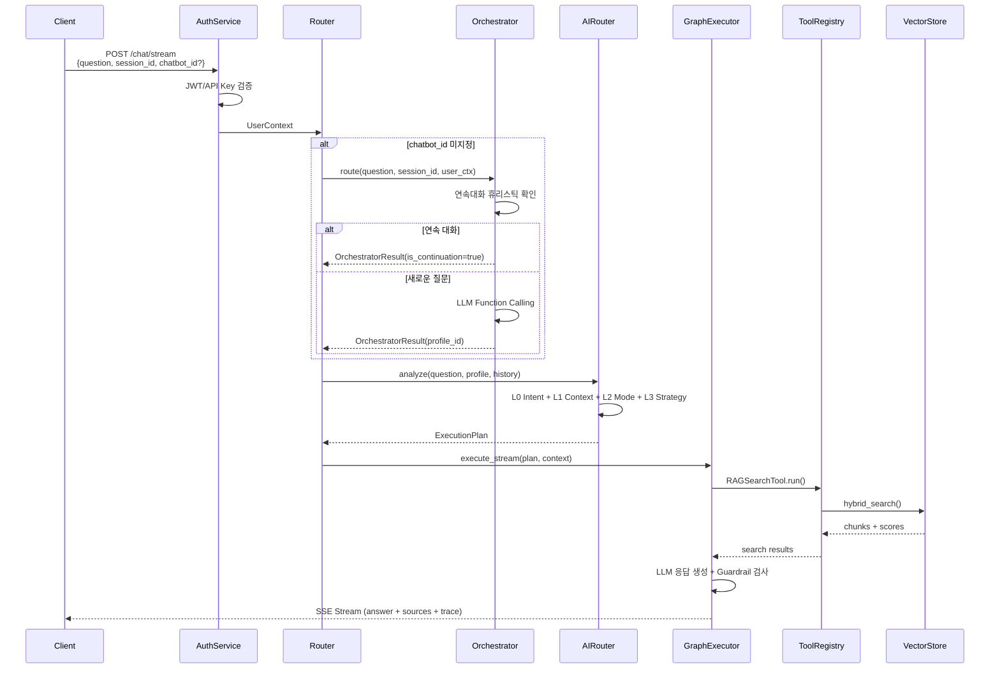
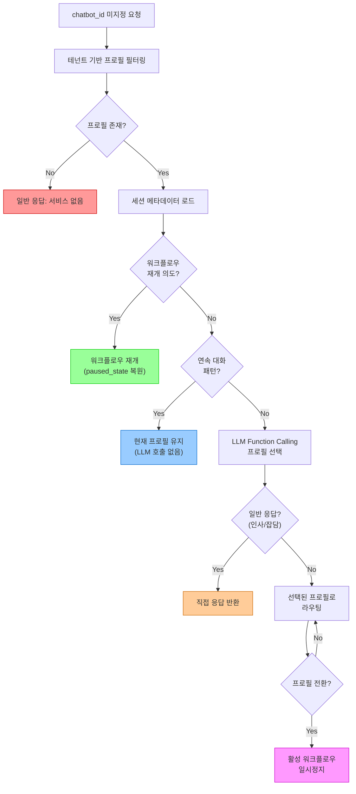
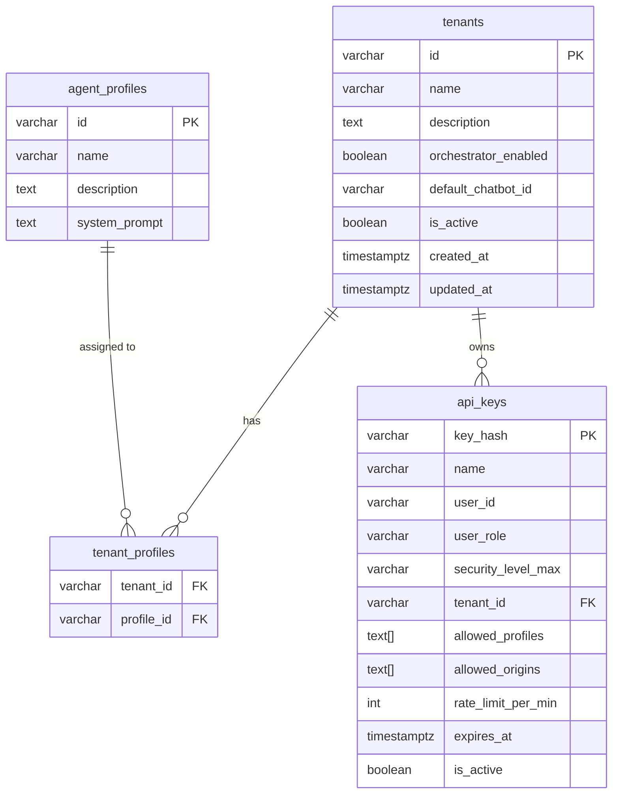
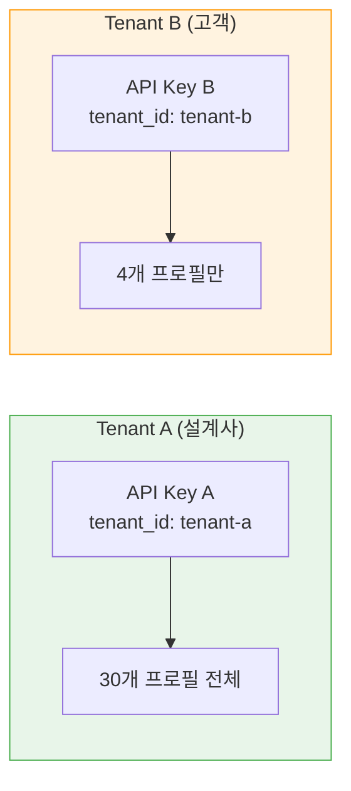
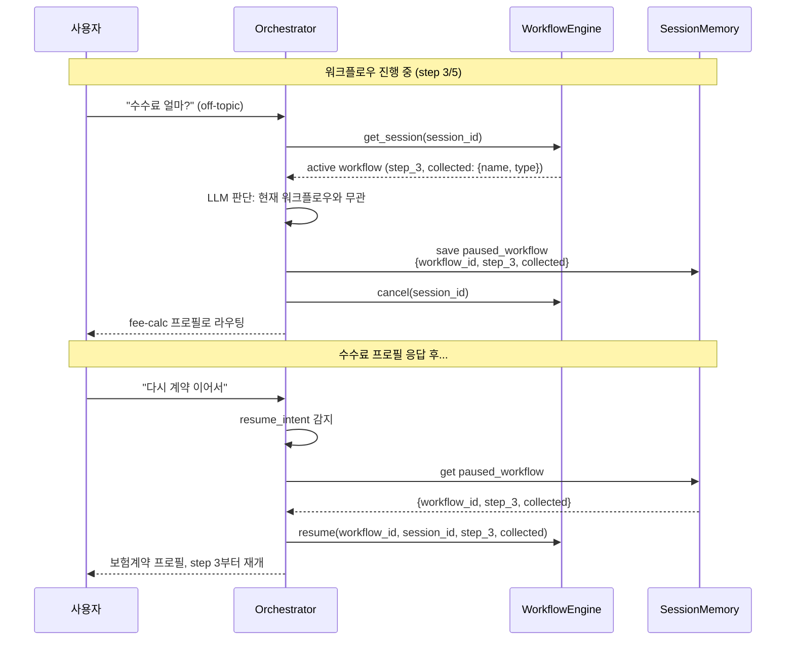
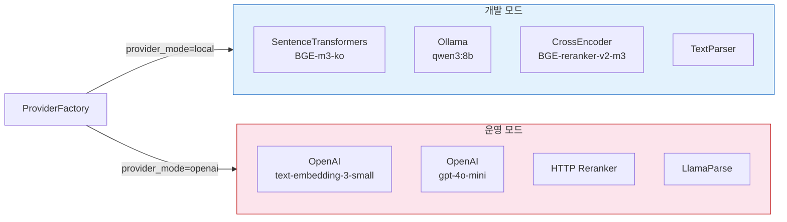
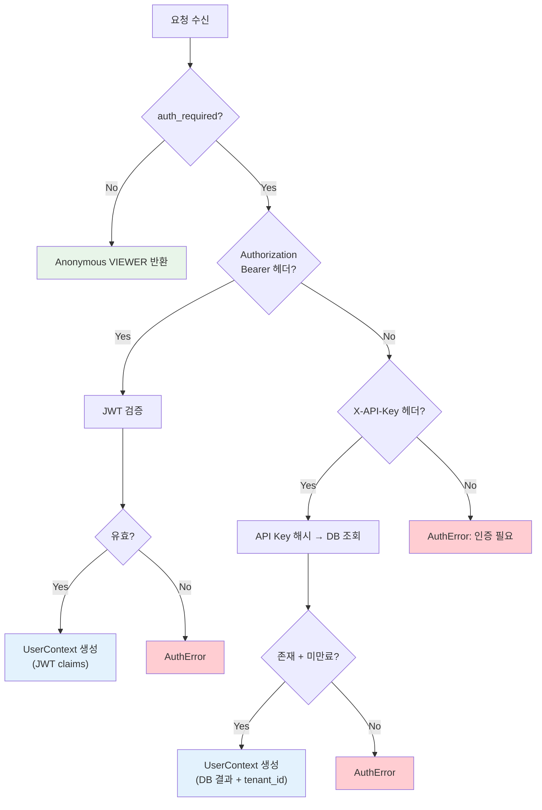
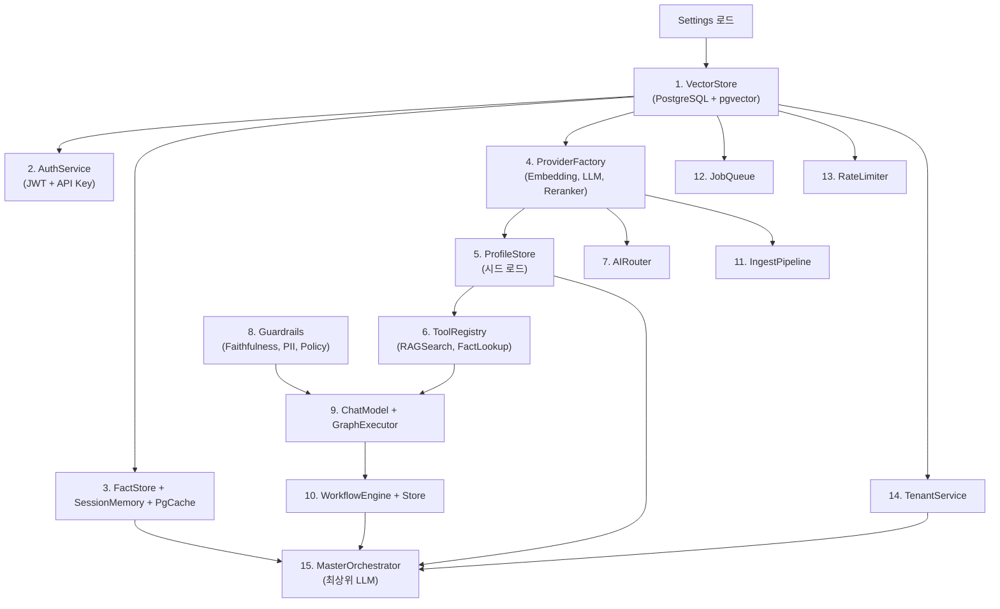

# AI Platform 시스템 아키텍처

## 개요

AI Platform은 멀티프로필 기반 엔터프라이즈 챗봇 플랫폼이다.
프로필(에이전트)별로 독립적인 도메인 지식과 워크플로우를 가지며,
Master Orchestrator가 사용자 질문을 분석하여 적절한 프로필로 자동 라우팅한다.

**핵심 설계 원칙:**
- `chatbot_id` 직접 지정 시 기존 흐름 그대로 동작 (하위 호환)
- `chatbot_id` 미지정 시 MasterOrchestrator가 자동 라우팅
- PostgreSQL only (Redis 없음)
- Provider 추상화로 개발/운영 모드 전환

---

## 전체 시스템 구조도



---

## 요청 처리 흐름



---

## Orchestrator 라우팅 로직



---

## 멀티테넌트 격리 구조





---

## 워크플로우 일시정지/재개



---

## 디렉토리 구조

```
src/
|-- main.py                          # FastAPI 앱 엔트리포인트
|-- bootstrap.py                     # 앱 상태 초기화 (15개 컴포넌트)
|-- config.py                        # Settings (환경변수)
|-- worker_main.py                   # Worker 프로세스 엔트리포인트
|
|-- gateway/                         # API 게이트웨이
|   |-- router.py                    # /chat, /chat/stream, /health
|   |-- admin_router.py              # /admin/* (프로필, 테넌트 관리)
|   |-- webhook_router.py            # /webhooks
|   |-- auth.py                      # JWT + API Key 인증
|   |-- models.py                    # 요청/응답 모델
|   |-- rate_limiter.py              # PostgreSQL Token Bucket
|   +-- streaming.py                 # SSE 스트리밍 유틸
|
|-- orchestrator/                    # Master Orchestrator (신규)
|   |-- orchestrator.py              # MasterOrchestrator.route()
|   |-- llm_adapter.py              # OpenAI/Anthropic Function Calling
|   |-- prompts.py                   # LLM 프롬프트 + Tool 정의
|   |-- models.py                    # OrchestratorResult, TenantConfig
|   +-- tenant.py                    # TenantService (멀티테넌트)
|
|-- router/                          # AI 라우터 (질문 분석)
|   |-- ai_router.py                 # L0~L3 분석 파이프라인
|   |-- intent_classifier.py         # 의도 분류
|   |-- context_resolver.py          # 맥락 해석
|   |-- mode_selector.py             # 에이전트 모드 결정
|   |-- strategy_builder.py          # 실행 전략 조합
|   +-- execution_plan.py            # ExecutionPlan 모델
|
|-- agent/                           # 에이전트 실행
|   |-- graph_executor.py            # LangGraph 실행기
|   |-- graphs.py                    # 그래프 정의
|   |-- nodes.py                     # 그래프 노드 (분석/검색/생성)
|   |-- state.py                     # 그래프 상태
|   |-- profile.py                   # 프로필 모델
|   |-- profile_store.py             # 프로필 저장소
|   |-- chat_model_factory.py        # ChatModel 팩토리
|   +-- tool_adapter.py              # 도구 어댑터
|
|-- tools/                           # 에이전트 도구
|   |-- base.py                      # 도구 기본 클래스
|   |-- registry.py                  # ToolRegistry
|   +-- internal/
|       |-- rag_search.py            # RAG 검색 도구
|       +-- fact_lookup.py           # 팩트 조회 도구
|
|-- safety/                          # 안전 가드레일
|   |-- base.py                      # 가드 기본 클래스
|   |-- faithfulness.py              # 충실성 검증
|   |-- pii_filter.py                # 개인정보 필터
|   +-- response_policy.py           # 응답 정책
|
|-- workflow/                        # 워크플로우 엔진
|   |-- engine.py                    # WorkflowEngine (start/advance/resume)
|   |-- store.py                     # WorkflowStore (YAML 시드)
|   |-- definition.py                # 워크플로우 정의 모델
|   +-- state.py                     # 워크플로우 상태
|
|-- infrastructure/                  # 인프라스트럭처
|   |-- vector_store.py              # PostgreSQL + pgvector
|   |-- fact_store.py                # 팩트 저장소
|   |-- job_queue.py                 # 작업 큐
|   |-- memory/
|   |   |-- session.py               # 세션 메모리
|   |   +-- cache.py                 # PgCache
|   +-- providers/                   # Provider 추상화
|       |-- factory.py               # ProviderFactory
|       |-- base.py                  # 기본 인터페이스
|       |-- embedding/               # 임베딩 (BGE-m3-ko, OpenAI, HTTP)
|       |-- llm/                     # LLM (Ollama, OpenAI, HTTP)
|       |-- parsing/                 # 파싱 (LlamaParse, Text)
|       +-- reranking/               # 리랭킹 (CrossEncoder, HTTP, LLM)
|
|-- observability/                   # 관측성
|   |-- logging.py                   # 구조화 로깅
|   |-- metrics.py                   # 메트릭
|   +-- trace_logger.py              # 요청 추적
|
+-- domain/                          # 도메인 모델
    +-- models.py                    # AgentMode, AgentResponse 등
```

---

## Provider 추상화



---

## 인증 흐름



---

## 앱 초기화 순서 (bootstrap.py)



---

## 기술 스택

| 영역 | 기술 | 용도 |
|------|------|------|
| 프레임워크 | FastAPI | API 서버 |
| DB | PostgreSQL + pgvector | 데이터 + 벡터 검색 |
| DB 드라이버 | asyncpg | 비동기 PostgreSQL |
| 마이그레이션 | Alembic | 스키마 관리 |
| 에이전트 | LangGraph | 그래프 기반 실행 |
| 스트리밍 | SSE (sse-starlette) | 실시간 응답 |
| 인증 | PyJWT + SHA-256 | JWT + API Key |
| 로깅 | structlog | 구조화 로깅 |
| 설정 | pydantic-settings | 환경변수 관리 |
| Orchestrator LLM | OpenAI / Anthropic | Function Calling |
